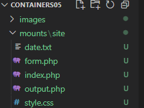
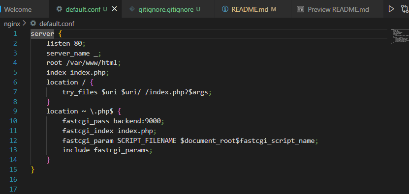
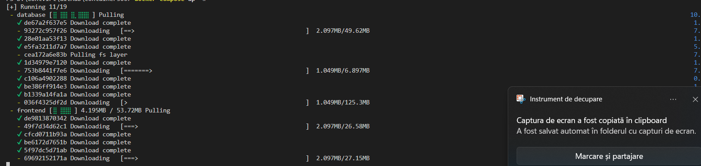
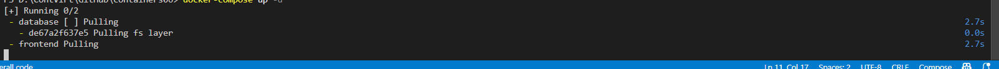
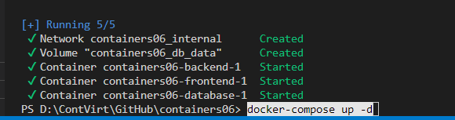
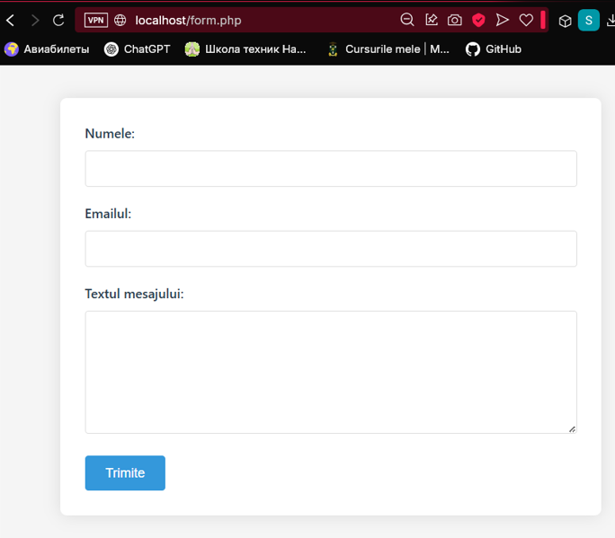

# Lucrarea de laborator numarul 6
### <i>Tema:</i> Crearea unei aplicații multi-container
### <i>Data:</i>12.04.2025 

## I. Scopul lucrării
Famialiarizarea cu gestiunea aplicației multi-container creat cu docker-compose.

## II. Sarcina
Creați o aplicație php pe baza a trei containere: nginx, php-fpm, mariadb, folosind docker-compose.

## Efectuarea lucrării
Am creat pentru inceput reposzitoriul `containers05` pe GitHub si l-am clonat pe computer. 

In directorul `containers05` am creat directorul `mounts/site` si am copiat in el un site `php`.



Am creat in continuare fiserul `.gitignore` in care am adaugat liniile:
```sh
# Ignore files and directories
mounts/site/*
```

In continuare creez fisierul `nginx/default.conf` cu următorul conținut necesar:




Dupa acestea creez in directorul `containers06` fisierul `docker-compose.yml` cu urmatorul continut:
```yml
version: '3.9'

services:
  frontend:
    image: nginx:1.19
    volumes:
      - ./mounts/site:/var/www/html
      - ./nginx/default.conf:/etc/nginx/conf.d/default.conf
    ports:
      - "80:80"
    networks:
      - internal
  backend:
    image: php:7.4-fpm
    volumes:
      - ./mounts/site:/var/www/html
    networks:
      - internal
    env_file:
      - mysql.env
  database:
    image: mysql:8.0
    env_file:
      - mysql.env
    networks:
      - internal
    volumes:
      - db_data:/var/lib/mysql

networks:
  internal: {}

volumes:
  db_data: {}
```

Si tot odata fisierul `mysql.env` cu datele
```sh
MYSQL_ROOT_PASSWORD=secret
MYSQL_DATABASE=app
MYSQL_USER=user
MYSQL_PASSWORD=secret
```

## Pornirea și testarea
Prin comanda `docker-compose up -d` pornesc containerul






## Concluzie
In urma acestei lucrari am realizat o aplicație multi-container folosind Docker Compose, formată din trei servicii: nginx, php-fpm și mysql. Am organizat fișierele, am configurat volume și rețele, iar prin comanda `docker-compose up -d` am pornit aplicația cu succes. Lucrarea ma ajutat să înțe cum funcționează containerele interconectate și cum se pot automatiza mediile de dezvoltare.

## Raspunsuri la intrebari
1. Containerele sunt pornite conform la ceea cum sunt scrise in `docker-compose.yml`: `frontend`, `backend` si `database`
2.  Datele bazei de date sunt stocate in volumul ce este definit in fisierul `docker-compose.yml`, sub forma: 
```yml
volumes:
  db_data: {}
```
Volumul este montat in containerul database din acest fisier la calea: `var/lib/mysql`

3. Containerele proiectului sunt numite sub forma
```sh
- containers06_frontend_1

- containers06_backend_1

- containers06_database_1
```
4. Voi crea in directorul curent fisierul `app.env` in care in continut voi scrie continutul `APP_VERSION=<version>`, apoi in fisierul `docker-compose.yml` si in `backend -> env_file` adaugam `-app.env`.
